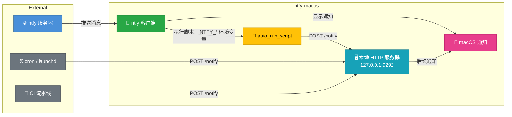

# ntfy-macos

[](https://github.com/Felix2yu/ntfy-macos/actions/workflows/build.yml)
[](https://buymeacoffee.com/laurentftech)
[](LICENSE)
[](https://www.apple.com/macos/)
[](https://swift.org/)
[](https://github.com/laurentftech/homebrew-ntfy-macos)
[]()

在 Mac 上接收来自任何来源的推送通知——服务器、IoT 设备、智能家居、CI 流水线或自定义脚本。无需注册账号，既可使用公共 [ntfy.sh](https://ntfy.sh) 服务，也支持自建服务器。

**ntfy-macos** 是一款原生 macOS 客户端，可订阅 ntfy 主题（topic），并推送带有 SF Symbols 图标、图片和交互按钮的富通知。收到消息时还能自动触发 shell 脚本。


## 功能特性

- **原生 macOS 通知**：支持 SF Symbols 图标与本地图片的富通知
- **多服务器支持**：同时连接多个 ntfy 服务器
- **Emoji 标签**：自动将 ntfy 标签转换为 emoji 并加入通知标题
- **交互按钮**：为通知添加自定义按钮，点击可执行脚本或打开链接
- **自动执行脚本**：收到消息时自动运行 shell 脚本
- **静默通知**：接收消息但不弹出通知横幅
- **安全认证**：令牌安全存储于 macOS 钥匙串（Keychain）
- **稳健的重连机制**：从容应对网络中断与睡眠/唤醒
- **优先级映射**：将 ntfy 优先级映射到 macOS 中断级别（紧急、时效性）
- **双运行形态**：双击 / `open` 打开是带 Dock 图标的主窗口应用，`serve` 启动则作为纯后台菜单栏服务
- **配置热重载**：自动检测并应用配置变更
- **配置校验**：在菜单栏提示未知配置项和拼写错误
- **点击打开**：点击通知在浏览器中打开链接（可按主题配置）
- **已读 / 删除跨设备同步**：历史窗口中的已读、删除操作会同步到服务端，其他设备的同类操作也会回写本地状态并撤销已弹出的通知横幅
- **自动请求权限**：首次启动时自动请求通知权限
- **本地通知服务器**：内建 HTTP 服务器（仅限 localhost），供脚本直接触发通知
- **设置窗口**：原生 SwiftUI 界面，配置服务器与主题，实时显示连接状态

## 安装

### 使用 Homebrew

```bash
# 添加 tap 源
brew tap laurentftech/ntfy-macos

# 安装
brew install ntfy-macos
```

### 从源码构建

```bash
# 克隆仓库
git clone https://github.com/Felix2yu/ntfy-macos.git
cd ntfy-macos

# 构建 app bundle
./build-app.sh

# 安装
sudo cp -r .build/release/ntfy-macos.app /Applications/
```

### 更新

```bash
# 通过 Homebrew 更新
brew update && brew upgrade ntfy-macos

# 重启服务以应用更新
brew services restart ntfy-macos
```

**注意**：通过 Homebrew 安装需要完整版 Xcode（仅 Command Line Tools 不够），因为应用是从源码构建的。

## 快速开始

1. **初始化配置**

```bash
ntfy-macos init
```

这会在 `~/.config/ntfy-macos/config.yml` 创建一份示例配置。

2. **编辑配置**

编辑配置文件，添加你的服务器和主题：

```yaml
servers:
  - url: https://ntfy.sh
    topics:
      - name: alerts
        icon_symbol: bell.fill

  - url: https://your-private-server.com
    token: tk_yourtoken
    topics:
      - name: deployments
        icon_symbol: arrow.up.circle.fill
        auto_run_script: ~/scripts/deploy-handler.sh
```

3. **（可选）将认证令牌存入钥匙串**

```bash
ntfy-macos auth add https://ntfy.sh tk_yourtoken
```

4. **启动服务**

```bash
# 使用 Homebrew services（推荐——崩溃后自动重启）
brew services start ntfy-macos

# 或直接运行
ntfy-macos serve
```

首次启动时，应用会自动请求通知权限。

两种运行形态共用同一份配置，启动后常驻菜单栏：

**图形界面（双击图标或 `open ntfy-macos.app`，未带任何参数）**
- 带 Dock 图标的标准应用，打开即显示 **通知历史** 主窗口
- 关闭主窗口不会退出应用，通知服务继续在后台运行；点击 Dock 图标可重新打开主窗口
- 屏幕顶部为完整的应用菜单：`ntfy-macos`（关于 / 设置 ⌘, / 隐藏 / 退出）、`文件`（通知历史 ⇧⌘H、重载配置 ⌘R、在 Finder 中显示配置、查看日志 ⇧⌘L、关闭 ⌘W）、`编辑`、`窗口`、`帮助`

**后台服务（`ntfy-macos serve`，含 `brew services` / launchd 拉起）**
- 不显示 Dock 图标，也不打开任何窗口

菜单栏功能：
- **服务器状态**：显示每个服务器的连接状态（绿色=已连接，红色=已断开，橙色闪烁=连接中）
- **设置**：打开设置窗口，配置服务器、主题和本地服务器（⌘,）
- **通知历史**：打开通知历史窗口（⇧⌘H）
- **在 Finder 中显示配置**：打开配置文件所在目录
- **重载配置**：应用配置变更（⌘R）
- **查看日志**：打开日志文件（自动轮转）（⌘L）
- **关于**：制作团队与相关链接
- **退出**：停止服务

5. **（可选）添加到启动台**

```bash
sudo ln -sf /usr/local/opt/ntfy-macos/ntfy-macos.app /Applications/
```

## 配置

配置文件位于 `~/.config/ntfy-macos/config.yml`。

完整的配置项列表和详细示例请参阅 [config-examples.yml](examples/config-examples.yml) 文件。

### 基本结构

```yaml
servers:
  - url: https://ntfy.sh
    topics:
      - name: alerts
        icon_symbol: bell.fill
        actions:
          - title: Open Dashboard
            type: view
            url: "https://dashboard.example.com"

  - url: https://your-private-server.com
    token: tk_yourtoken
    topics:
      - name: deployments
        icon_symbol: arrow.up.circle.fill
        auto_run_script: ~/scripts/deploy-handler.sh
```

### 配置项说明

#### 全局字段

- `local_server_port`（可选）：本地通知 HTTP 服务器的端口（例如 `9292`）。省略则禁用。

#### 服务器字段

- `url`（必填）：服务器地址
- `token`（可选）：认证令牌
- `topics`（必填）：主题列表

#### 主题字段

- `name`（必填）：主题名称
- `icon_symbol`（可选）：SF Symbol 图标名称
- `icon_path`（可选）：本地图片文件路径
- `auto_run_script`（可选）：每条消息到达时自动执行的脚本
- `silent`（可选）：设为 `true` 则不弹出通知横幅
- `click_url`（可选）：点击通知时打开的自定义链接
- `actions`（可选）：交互按钮列表

#### 动作（Action）字段

- `title`（必填）：按钮文字
- `type`（必填）：`script`、`view`、`shortcut` 或 `applescript`
- `path`（`script` 和 `applescript` 文件用）：脚本文件的绝对路径
- `url`（`view` 用）：要打开的链接
- `name`（`shortcut` 用）：macOS 快捷指令名称
- `script`（`applescript` 内联用）：AppleScript 源代码

**注意**：配置文件中定义的动作**始终覆盖**消息自带的动作。

各类动作的处理方式汇总：

| 动作类型    | ntfy 协议 | ntfy-macos（消息负载）     | ntfy-macos（config.yml）    |
| ----------- | --------- | -------------------------- | --------------------------- |
| view        | ✅ 标准    | ✅ 支持                     | ✅ 支持                      |
| http        | ✅ 标准    | ✅ 支持                     | ❌ 不支持（有意为之）        |
| broadcast   | ✅ 标准    | ❌ 忽略（仅 Android）       | ❌ 不适用                    |
| script      | ❌         | ❌ 禁止                     | ✅ 支持                      |
| applescript | ❌         | ❌ 禁止                     | ✅ 支持                      |
| shortcut    | ❌         | ❌ 禁止                     | ✅ 支持                      |

> `script`、`applescript` 和 `shortcut` 动作**只能通过 config.yml 配置**——无法通过消息负载触发。这样可防止远程代码执行。

**注意**：`applescript` 和 `shortcut` 是 **ntfy-macos 客户端特有的动作类型**。官方 ntfy 协议仅包含 `view`、`http`、`broadcast` 和 `dismiss`。

## CLI 命令

### serve

启动通知服务：

```bash
ntfy-macos serve
```

### auth

管理钥匙串中的认证令牌：

```bash
# 添加令牌
ntfy-macos auth add <server-url> <token>

# 列出所有已存储的令牌
ntfy-macos auth list

# 删除令牌
ntfy-macos auth remove <server-url>
```

钥匙串中的令牌优先于 YAML 配置文件中的令牌。

### test-notify

发送一条测试通知（并请求权限）：

```bash
ntfy-macos test-notify --topic <NAME>
```

### init

创建示例配置文件：

```bash
ntfy-macos init
```

### help

显示帮助信息：

```bash
ntfy-macos help
```

## 脚本执行

脚本通过第一个参数（`$1`）接收消息正文，并通过环境变量接收完整的消息上下文：

```bash
#!/bin/bash
MESSAGE="$1"

# 可用的环境变量：
# NTFY_ID       - 消息唯一 ID
# NTFY_TOPIC    - 主题名称
# NTFY_TIME     - Unix 时间戳
# NTFY_EVENT    - 事件类型（恒为 "message"）
# NTFY_TITLE    - 消息标题（如有）
# NTFY_MESSAGE  - 消息正文（如有）
# NTFY_PRIORITY - 优先级 1-5（如有）
# NTFY_TAGS     - 逗号分隔的标签（如有）
# NTFY_CLICK    - 点击链接（如有）

echo "[$NTFY_TOPIC] $NTFY_TITLE: $MESSAGE"
# 你的自动化逻辑写在这里
```

### 运行环境

脚本执行时使用增强的 PATH：

```
/opt/homebrew/bin:/usr/local/bin:/usr/bin:/bin:/usr/sbin:/sbin
```

确保 Homebrew 安装的工具可直接调用。

### 赋予脚本执行权限

```bash
chmod +x /path/to/your/script.sh
```

### 安全须知

脚本**只在本地 `config.yml` 中明确配置后才会执行**。ntfy-macos 绝不会执行来自消息内容的任意代码。

**最佳实践：**
- 只配置你信任且审查过的脚本
- 脚本使用绝对路径
- 公共主题避免使用 `auto_run_script`
- 妥善保管配置文件（`chmod 600 ~/.config/ntfy-macos/config.yml`）
- 涉及敏感自动化时，使用带认证的自建 ntfy 服务器
- 使用 `allowed_schemes` 和 `allowed_domains` 限制可打开的链接范围。

## 本地通知服务器

ntfy-macos 可以在 localhost 上运行一个本地 HTTP 服务器，让脚本和本地工具直接触发 macOS 通知，无需经过外部 ntfy 服务器。



### 配置方法

在 `config.yml` 根级别添加 `local_server_port`：

```yaml
local_server_port: 9292

servers:
  - url: https://ntfy.sh
    topics:
      - name: alerts
```

### 使用方法

发送 POST 请求即可触发通知：

```bash
curl -X POST http://127.0.0.1:9292/notify \
  -H "Content-Type: application/json" \
  -d '{"title": "Build Complete", "message": "Project compiled successfully", "priority": 3, "tags": ["white_check_mark"]}'
```

### API

**POST /notify**

| 字段       | 类型     | 必填 | 说明                                     |
|------------|----------|------|------------------------------------------|
| `title`    | string   | 是   | 通知标题                                 |
| `message`  | string   | 是   | 通知正文                                 |
| `priority` | integer  | 否   | 优先级 1-5（映射到 macOS 中断级别）      |
| `tags`     | string[] | 否   | Emoji 标签（如 `["warning", "fire"]`）   |

**GET /health** - 返回 `{"status": "ok"}`，用于健康检查。

### 示例：自动脚本 + 本地通知联动

将 `auto_run_script` 与本地服务器结合，可以构建丰富的反馈闭环：

```bash
#!/bin/bash
# 主题 "deployments" 的 auto_run_script
# 通过 $1 和环境变量接收消息，然后触发本地后续通知

RESULT=$(deploy.sh "$NTFY_MESSAGE" 2>&1)
EXIT_CODE=$?

if [ $EXIT_CODE -eq 0 ]; then
  curl -s -X POST http://127.0.0.1:9292/notify \
    -d "{\"title\": \"Deploy Success\", \"message\": \"$NTFY_MESSAGE deployed successfully\", \"tags\": [\"white_check_mark\"]}"
else
  curl -s -X POST http://127.0.0.1:9292/notify \
    -d "{\"title\": \"Deploy Failed\", \"message\": \"$RESULT\", \"priority\": 4, \"tags\": [\"x\"]}"
fi
```

### 安全性

- 仅绑定 `127.0.0.1`（外部网络无法访问）
- 请求体最大 4 KB
- 不执行任何代码——只触发通知
- 默认禁用（需在配置中设置 `local_server_port`）
- 可通过设置窗口配置（点击锁图标解锁编辑，输入端口号）
- 使用内置的 curl 示例测试（点击"拷贝"按钮）

## 优先级映射

ntfy 优先级与 macOS 中断级别的对应关系：

- 优先级 5 → 紧急（Critical，穿透专注模式）
- 优先级 4 → 时效性（Time Sensitive，醒目展示）
- 优先级 1-3 → 普通（Active，常规通知）

## SF Symbols

图标可以使用任意 SF Symbol 名称。使用 Apple 免费提供的 SF Symbols 应用浏览全部图标。

## Markdown 消息

macOS 原生通知仅支持纯文本，无法渲染格式化的 markdown。ntfy-macos 会自动剔除消息中的 markdown 语法，让显示更清爽。

## Emoji 标签

ntfy 支持在 `Tags` 字段中使用 [emoji 短代码](https://docs.ntfy.sh/emojis/)。这些短代码会自动转换为 emoji，并添加到通知标题前。

示例：`Tags: warning,fire` → **⚠️🔥 Alert**

## 常见问题（FAQ）

### 通知不显示怎么办？

- **专注模式**：检查是否开启了专注模式/勿扰模式。
- **权限**：前往 系统设置 → 通知 → ntfy-macos，确认已允许通知。
- **后台运行**：如果通过 `brew services` 启动，请确保应用有后台运行权限。

### 权限弹窗点击无响应

如果权限弹窗无法点击：

1. 停止服务：`brew services stop ntfy-macos`
2. 手动授权：系统设置 → 通知 → ntfy-macos → 允许通知
3. 重启服务：`brew services start ntfy-macos`

## 故障排查

- **日志**：`~/.local/share/ntfy-macos/logs/ntfy-macos.log`
- **测试通知**：`ntfy-macos test-notify --topic test`
- **连接问题**：核对服务器地址和令牌。
- **脚本未执行**：确认脚本有执行权限（`chmod +x`）。

## 架构

- **Swift 6**：现代 Swift，严格并发检查
- **URLSession**：原生流式 JSON 支持
- **UserNotifications**：富 macOS 通知
- **Security 框架**：钥匙串集成
- **Yams**：YAML 解析
- **Foundation & AppKit**：macOS 核心框架

## 参与贡献

欢迎贡献！请在 GitHub 上提交 issue 或 pull request。

## 许可证

MIT License

## 致谢

本项目是 [ntfy](https://ntfy.sh) 的第三方客户端，ntfy 由 [Philipp C. Heckel](https://github.com/binwiederhier) 创建。

## 相关项目

- [ntfy](https://ntfy.sh) - 简洁的 pub-sub 通知服务
- [ntfy-android](https://github.com/binwiederhier/ntfy-android) - 官方 Android 应用
- [ntfy-ios](https://github.com/binwiederhier/ntfy-ios) - 官方 iOS 应用

## 支持

如遇 bug 或有功能需求，请在 GitHub 上提交 issue。
